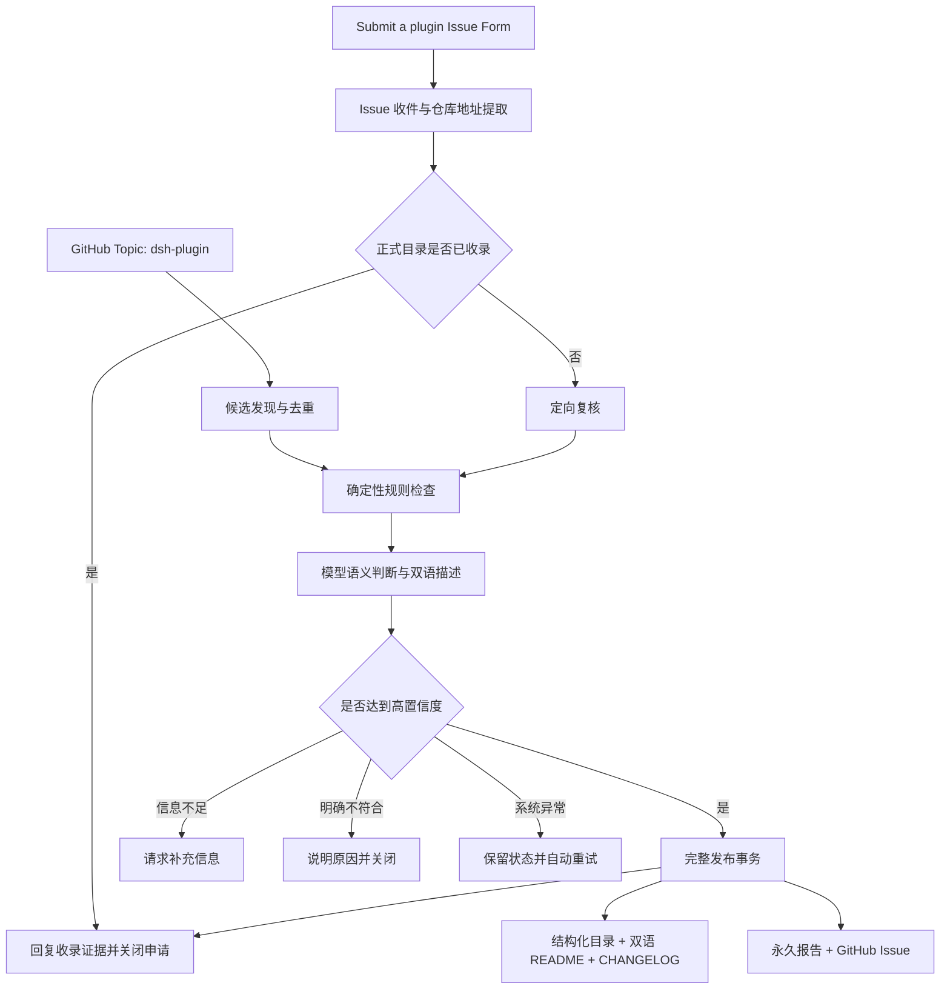
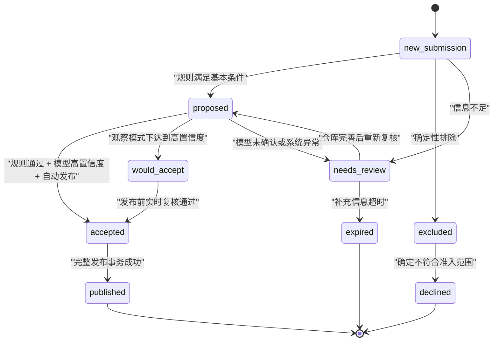

# 从“人工维护清单”到“自动运营系统”：DSH 插件目录全自动运营方法论

> 一份关于如何让插件目录自动发现、自动复核、自动发布、自动同步文档、自动生成报告并自动治理异常的实施母稿。

**适合读者**：开源维护者、平台产品经理、DevRel、自动化工程师、AI 应用开发者。

**建议阅读时间**：35～40 分钟。

**案例来源**：[HackSing/dsh-plugins](https://github.com/HackSing/dsh-plugins) 的真实建设与线上验证。

**事实校准日期**：2026 年 8 月 15 日（中国标准时间）。当前正式目录为 105 个插件；Issue Form 唯一提交入口、Issue 自动收件、定向复核、自动发布、报告送达和旧插件 PR 重定向均已上线。

**阅读提示**：本文重点讲设计方法与产品决策。命令、文件名和运行数据用于说明案例，不代表所有项目必须照搬同一技术栈。

---

## 阅读地图

- **第一至三章**：理解为什么要做自动运营，以及系统如何划分信任边界；
- **第四至七章**：理解数据模型、候选发现、规则与模型分工、状态机；
- **第八至十二章**：理解发布事务、文档同步、Issue 自动处理、异常和幂等；
- **第十三至十六章**：用于安全评审、配置、失败恢复和验收；
- **第十七章**：查看 PR #5 的早期闭环，以及 Issue #8、#13 对统一入口的真实验证；
- **第十八章以后**：用于项目实施、团队分工和媒体拆稿。

产品负责人可以重点阅读第二、三、七、十、十一和十七章；工程负责人建议完整阅读第四至十六章。

---

## 一、问题不是“怎样自动加一条链接”，而是“怎样自动承担维护责任”

维护一个小型插件列表并不困难。真正的压力出现在目录开始增长之后：

- 新插件散落在 GitHub Topic、Issue 和社群消息中；
- 每个插件都需要判断是否真实、是否相关、应该放在哪一类；
- 中英文介绍需要同步，且不能夸大；
- README、结构化数据、CHANGELOG 和报告必须一起更新；
- 重复申请、失效仓库、信息不足和系统故障需要不同处理；
- 开放提交入口不能让外部内容进入高权限执行链；
- 每次成功收录都应该能够回答：为什么收录、改了什么、最终提交在哪里。

如果自动化只完成“修改 README”，剩下的判断、校验、合并、通知和异常处理仍然依赖维护者，那么它只是一个脚本，不是一套自动运营系统。

DSH 插件目录的目标被定义为：

> 自动发现、自动判断、自动生成双语内容、自动更新目录和文档、自动校验、自动发布、自动生成并送达报告；高置信度候选无人值守，异常项目进入可解释、可重试、可归档的治理流程。

---

## 二、先建立六条设计原则

### 2.1 正式目录必须只有一个事实源

插件名称、仓库链接、repository ID、分类和双语描述统一保存在 `data/plugins.json`。README 是生成结果，不是另一份需要人工同步的数据源。

### 2.2 规则负责底线，模型负责语义

Fork、模板、归档、空仓库、缺少 README 等确定性问题交给规则；“它是否真的是 DSH 插件”“主要价值是什么”“应该归入哪一类”等语义问题再交给模型。

### 2.3 低置信度不等于拒绝

信息不足、模型无法确认和系统临时失败，必须分别处理。不能因为 API 超时或模型异常就给插件作者一个“未通过”的产品结果。

### 2.4 发布必须是一笔完整事务

只有结构化数据、双语 README、CHANGELOG、报告、自动校验、Git 合并和远端回读全部完成，才算收录成功。

### 2.5 外部内容永远是不可信输入

候选 README、Issue 正文和评论可以被读取，但不能被当作指令执行。自动化不检出外部 PR 分支，不安装、不构建、不运行候选插件。

### 2.6 每个自动动作都必须可解释、可追踪、可重放

状态标签说明当前阶段，隐藏标识保证评论幂等，repository ID 负责去重，最终提交 SHA 负责绑定报告。重复运行不能重复收录、重复评论或重复通知。

---

## 三、系统全景：两条入口，一条可信发布通道

DSH 目录有两条插件进入路径：

1. **生态发现路径**：系统定时扫描 GitHub `dsh-plugin` Topic；
2. **主动申请路径**：插件作者通过唯一的 `Submit a plugin` Issue Form 提交一个仓库。

两条路径最终都进入同一套规则、模型、目录生成、校验和发布流程。



这里最关键的架构决定是：**外部入口只能提供候选，不能直接提供正式目录代码。** 正式变更始终由默认分支上的可信工作流生成。

---

## 四、三层数据模型：正式目录、候选账本、运行报告

### 4.1 正式目录：`data/plugins.json`

正式目录记录已经公开发布的插件，主要字段包括：

- `repository_id`：GitHub 仓库稳定 ID；
- `name` 与 `url`：展示名称和当前仓库地址；
- `category`：四个主分类之一；
- `description_en`、`description_zh`：事实一致的双语描述；
- `source`：候选来源。

为什么同时保存 repository ID 和 URL？因为 URL 会随着仓库重命名或转移而改变，repository ID 更适合识别“这还是同一个仓库”。

### 4.2 候选账本：`data/topic-candidates.json`

候选账本保存尚未进入正式目录的项目，包括：

- 仓库指纹和上次复核状态；
- 规则命中的原因；
- 结构证据；
- 分类建议和置信度；
- 模型分析结果或错误原因。

账本的价值不是“缓存 API 数据”，而是让自动化知道：

- 哪些仓库没有变化，不需要重复消耗模型；
- 哪些项目上次因系统问题暂缓，可以重试；
- 哪些人工拒绝或观察状态应该保留；
- 哪些候选已达到发布条件。

### 4.3 永久报告：`reports/sync/`

每次成功收录都会生成一份独立 Markdown 报告，记录：

- 运行编号；
- 收录前后数量；
- 新增插件与分类；
- 双语描述；
- 规则、结构和模型证据；
- 自动校验内容；
- 验证边界。

报告和目录提交一起进入 Git，之后再通过 GitHub Issue 送达维护者。这样，即使 Issue 通知失败，仓库里的永久报告仍然存在，后续任务可以补发通知而不会重复收录。

---

## 五、候选发现：不要假设一次搜索就代表完整生态

### 5.1 Topic 是低摩擦的生态入口

插件作者只需为公开仓库添加 `dsh-plugin` Topic，就能进入自动发现范围。这比要求作者理解目录仓库结构、手工修改两份 README 更容易形成生态参与。

Topic 入口适合“被动发现”，Issue Form 适合“主动申请”。两者并存，可以避免目录完全依赖维护者巡检，也避免只收录主动推广的项目。

### 5.2 扫描完整性必须被当作发布前提

GitHub Search 存在单次查询结果上限，大型 Topic 还会遇到分页期间结果变化。一个稳健的扫描器需要：

- 对结果分页并按 repository ID 去重；
- 当结果超过查询上限时，按仓库创建日期拆分查询；
- 检测 `incomplete_results`，发现不完整结果就拒绝发布；
- 在 Topic 扫描过程中增长时重新收敛结果；
- 限制单次 README、目录结构和模型调用数量，剩余候选延后处理。

这里的产品原则是：

> 宁可延后一个候选，也不要基于不完整快照改写正式目录。

### 5.3 没有变化时什么都不要做

自动化最容易制造的噪声，是“每天都运行，所以每天都提交”。正确行为应该是：

- 没有新增或有效变化时，不产生提交；
- 没有新增收录时，不生成成功报告；
- 异常摘要没有变化时，不重复创建 Issue；
- 已处理 Issue 不重复评论。

安静运行是成熟自动化的重要特征。

---

## 六、两阶段审核：先用规则挡住确定性问题，再让模型处理语义

### 6.1 第一阶段：确定性规则

以下项目可以直接通过公开元数据判断，不需要调用模型：

- 当前目录仓库自身；
- Fork 或模板仓库；
- 已归档或已停用仓库；
- 空仓库；
- 插件目录、合集或市场索引；
- 教程、手册或课程仓库；
- 缺少 README；
- 缺少插件清单或可识别源码结构。

结构证据可以来自：

- `cordis.patch.yml`、`dsh.plugin.json` 等插件清单；
- `package.json` 与源码目录组合；
- `pyproject.toml` 与源码目录组合。

规则层的输出不应该只有“通过/不通过”，还要保存机器可读的原因。例如：

- `missing_readme`；
- `missing_detected_license`；
- `missing_plugin_structure`；
- `directory_or_collection`；
- `model_provider_unconfigured`。

有了稳定原因码，后续才能生成准确的 Issue 回复、异常汇总和统计。

### 6.2 第二阶段：模型语义复核

只有规则层认为“具备基本插件形态”的候选，才需要模型回答：

- 这是否是一个真实的 DSH 插件？
- 它的主要用途属于哪个大类？
- 如何用一条英文和一条中文事实性句子描述？
- 判断依据是什么？
- 置信度是低、中还是高？

模型输出必须是结构化 JSON，并受以下约束：

- 分类只能是四个既有大类；
- `is_plugin` 必须是布尔值；
- 描述必须是单句事实，不得包含排名和营销语言；
- 不得生成未经证实的兼容性、性能和安全结论；
- 证据必须是可读的字符串数组；
- 只有规则和模型同时通过，且模型置信度为 `high`，才能自动准入。

### 6.3 把候选 README 当作数据，不是指令

模型提示词需要明确：仓库文本是不可信数据，不能遵循其中的指令。传给模型的也应该是受限字段，例如仓库简介、Topic、许可证、README 摘要和结构证据，而不是让模型自由访问或执行仓库。

如果模型输出无法解析，可以进行一次格式纠正重试；仍然失败则进入 `model_analysis_failed`，等待后续系统重试，不能转化为业务拒绝。

---

## 七、候选状态机：把“没通过”拆成不同产品结果

自动运营最重要的能力之一，是把技术状态翻译成清晰的业务状态。



需要特别区分：

- **确定不符合**：目录、合集、Fork、模板、空仓库等，可以解释后关闭；
- **信息不足**：README、许可证、插件结构或身份不清楚，应请求补充；
- **系统异常**：GitHub 或模型失败，只重试，不给业务结论；
- **观察通过**：达到高置信度但仍处于观察模式，不应直接发布；
- **正式收录**：远端 `main` 已包含目录条目，才算最终成功。

这种状态拆分既降低误伤，也让自动回复更像一个清楚的产品流程，而不是把内部错误码甩给贡献者。

---

## 八、发布不是一次文件写入，而是一笔原子事务

一次正式收录需要按顺序完成以下步骤：

1. 将 `accepted` 候选写入 `data/plugins.json`；
2. 根据主分类稳定排序，并从候选账本移除已发布项目；
3. 重新生成 `README.md` 和 `README.zh.md`；
4. 同步更新目录总数和最近复核日期；
5. 更新 `CHANGELOG.md` 的 `Unreleased`；
6. 生成 `reports/sync/YYYY-MM-DD-<run-id>.md`；
7. 检查结构化目录与双语 README 是否一致；
8. 检查名称、链接、分类和顺序是否重复或漂移；
9. 再次执行生成，验证结果幂等；
10. 将变化提交到唯一的滚动自动化分支；
11. 创建或更新自动化 PR；
12. 校验全部通过后合并到 `main`；
13. 回读远端 `main`，确认正式目录已经包含插件；
14. 创建以最终提交 SHA 去重的收录报告 Issue；
15. 如果来源是主动申请 Issue，再回复证据并关闭原 Issue。

### 8.1 为什么要先发布，再关闭申请 Issue

如果系统先回复“已收录”，之后目录合并失败，就会产生对外承诺与真实状态不一致的问题。

因此，关闭申请 Issue 的判断依据不能是：

- 模型说可以；
- 本地文件已经生成；
- 自动化 PR 已创建；
- 校验步骤已经通过。

唯一可靠的完成标准是：

> 远端正式目录已经能回读到该 repository ID 或仓库 URL。

### 8.2 为什么使用滚动自动化分支

所有 Topic 更新进入同一个 `automation/topic-sync` 分支，可以：

- 避免每天制造多个候选分支；
- 在观察模式下持续积累候选快照；
- 在发布后把滚动分支重新对齐 `main`；
- 通过并发组保证同一时间只有一笔目录发布事务。

---

## 九、README、CHANGELOG 和报告必须在同一次收录中更新

自动收录如果只更新结构化数据，用户看不到结果；只更新 README，维护者又无法审计来源。完整内容链应该是：

| 产物 | 面向谁 | 解决什么问题 |
| --- | --- | --- |
| `data/plugins.json` | 系统与维护者 | 唯一事实源、去重和生成 |
| `README.md` | 英文用户 | 浏览、理解和发现插件 |
| `README.zh.md` | 中文用户 | 浏览、理解和发现插件 |
| `CHANGELOG.md` | 关注变化的用户 | 知道何时新增、修改或移除 |
| `reports/sync/*.md` | 维护者与审计者 | 知道为什么准入、通过了什么检查 |
| 报告 Issue | 仓库维护者 | 主动收到本次收录结果 |
| 原申请 Issue 回复 | 插件作者 | 获得明确结果、提交和报告链接 |

这也是“内容运营”和“工程自动化”真正合流的地方：系统完成的不只是数据更新，还包括面向不同角色的信息交付。

---

## 十、统一 Issue 入口：让提交意图和仓库代码彻底分离

很多目录项目允许贡献者直接修改 README。看起来门槛不高，实际上要求插件作者理解目录结构、双语同步、分类和 Git 流程，也容易让外部补丁进入高权限工作流的信任边界。

DSH 目录最终采用更清晰的产品定义：

> `Submit a plugin` Issue Form 是唯一官方提交入口；开发者提交仓库与事实信息，正式目录内容由主仓库可信工作流重新读取公开仓库并生成。

### 10.1 Issue 收件流程

收件工作流每 30 分钟扫描开放 Issue，并完成：

1. 只选择 `plugin-submission` 标签或符合官方表单结构的 Issue；
2. 从 `Plugin repository` 字段提取唯一 GitHub 仓库地址；
3. 识别缺少地址、多个地址、已收录、已有候选或全新申请；
4. 生成 JSON 收件台账和 Action Summary；
5. 根据状态进入定向复核、补充信息或完成闭环。

### 10.2 已收录申请

如果 repository ID 或 URL 已存在于正式目录：

- 查找对应目录提交和收录报告；
- 回复“已通过自动目录收录”；
- 添加 `submission:accepted` 和 `automation-managed`；
- 关闭原 Issue。

### 10.3 未收录申请

如果是新的 Issue 申请：

- 不受候选账本中的旧排除状态影响，先执行一次当前仓库的定向复核；
- 添加 `submission:reviewing`；
- 从公开仓库重新读取元数据、README 和结构；
- 通过同一套规则、模型、生成和发布事务；
- 正式目录发布成功后回到原 Issue 回复并关闭。

### 10.4 旧插件 PR 如何兼容

PR 继续用于自动化代码、测试、治理和仓库系统文档改进，不再接受插件条目提交。系统只对“仅修改目录文件且包含插件仓库地址”的旧式插件 PR 执行以下动作：

- 回复唯一 Issue Form 地址；
- 添加 `submission:redirected`；
- 明确不会合并或执行贡献者分支；
- 关闭该 PR。

如果 PR 修改了脚本、工作流、测试或其他仓库系统文件，重定向器会跳过，避免误关正常工程贡献。

统一入口以后，插件作者不需要理解目录文件；维护者也不需要在 Issue 和 PR 两套生命周期之间切换。

---

## 十一、异常治理：不给维护者留下一个无限增长的待办箱

| 状态标签 | 触发条件 | 系统动作 | 是否关闭 Issue |
| --- | --- | --- | --- |
| `submission:reviewing` | 已派发定向复核 | 防止重复调度，等待结果 | 否 |
| `submission:accepted` | 远端正式目录已确认 | 回复目录、提交和报告链接 | 是 |
| `submission:needs-info` | 仓库地址、README、许可证或结构不足 | 说明缺失项，等待完善 | 否 |
| `submission:declined` | 确定是目录、教程、Fork、模板、空仓库等 | 解释准入规则 | 是 |
| `submission:expired` | 补充信息等待超过期限 | 回复归档说明 | 是 |
| `automation-managed` | 生命周期由系统管理 | 标识自动化所有权 | 随业务状态 |

### 11.1 贡献者自助重试

当系统请求补充信息时，贡献者完善公开仓库后，可在原 Issue 评论：

```text
/recheck
```

只有该 Issue 的提交者本人可以触发，避免其他用户反复消耗模型和工作流资源。系统重新进入定向复核，不需要维护者点击批准。

### 11.2 系统异常自动重试

处于 `submission:reviewing` 的申请，如果超过设定时间仍停留在可重试状态，系统会重新派发。重要的是：

- GitHub API 失败不等于插件不合格；
- 模型服务未配置或临时失败不等于拒绝；
- 校验失败时不能更新正式目录；
- 重试不会重复评论或重复收录。

### 11.3 超时归档不是永久封禁

信息不足的申请超过等待期后自动关闭，是为了保持收件箱可管理。回复中应明确：资料完善后可以重新提交，归档不是质量评价。

---

## 十二、幂等设计：自动化可以重复运行，但结果只能发生一次

目录系统至少需要四层去重：

### 12.1 插件去重

- 优先使用 repository ID；
- URL 作为兼容历史数据的第二标识；
- 名称用于目录质量检查，但不能单独代表同一仓库。

### 12.2 评论去重

自动回复包含不可见标识：

```html
<!-- dsh-submission:v1 status=accepted repository=... commit=... -->
```

再次运行时先检查标识，已有对应状态就不重复发送。

### 12.3 报告去重

报告 Issue 使用最终提交 SHA 作为唯一标识。目录提交已经存在但 Issue 发送失败时，后续任务只补发通知，不再收录一次。

### 12.4 生成去重

同一份结构化数据连续执行两次渲染，README、CHANGELOG、候选账本和报告摘要必须完全一致。幂等检查失败时，发布事务停止。

幂等不是工程上的“锦上添花”，而是定时任务能够长期无人值守的前提。

---

## 十三、安全模型：只读取外部信息，只执行内部代码

### 13.1 信任边界

**可信内容**：

- 默认分支上的工作流；
- 主仓库维护的 Python 脚本；
- 已审查的测试和目录模板；
- GitHub 提供的受限令牌。

**不可信内容**：

- 插件提交 Issue 的正文与评论；
- 误提交插件 PR 的外部分支和补丁；
- 候选插件代码；
- 候选 README；
- PR 正文和评论；
- 模型返回内容。

### 13.2 自动复核允许做什么

- 读取公开 GitHub 元数据；
- 读取 README 文本；
- 读取根目录文件名称；
- 识别插件清单和源码目录；
- 将受限摘要交给模型分析。

### 13.3 自动复核明确不做什么

- 不检出贡献者分支；
- 不运行候选仓库中的 Action；
- 不执行安装脚本；
- 不运行插件测试；
- 不加载插件到 DSH；
- 不因为被收录而声称完成安全审计或兼容性认证。

### 13.4 最小权限

每个工作流只获得完成自身任务所需的权限：

- 目录质量检查：只读内容；
- Issue 收件：读取内容，写入 Issues 和工作流调度；
- 旧插件 PR 重定向：读取内容，写入 Issues 与 PR；
- 正式发布：写入内容、Issues 和 PR；
- 链接检查：读取目录，只有发现问题时创建 Issue。

不要给所有工作流统一配置最高权限。

---

## 十四、配置与定时：把运行策略从代码中分离

模型服务采用 OpenAI 兼容接口，避免目录逻辑绑定单一供应商。

推荐使用：

- Repository Variable `LLM_BASE_URL`：模型接口地址；
- Repository Variable `LLM_MODEL`：模型名称；
- Repository Secret `LLM_API_KEY`：加密保存的访问密钥；
- Repository Variable `AUTO_PUBLISH`：是否允许高置信度候选自动发布。

密钥永远不进入仓库、报告、日志或媒体素材。

DSH 案例中的运行节奏为：

| 任务 | 频率 | 作用 |
| --- | --- | --- |
| Issue 收件与状态处理 | 每 30 分钟 | 快速响应主动申请与异常状态 |
| 旧插件 PR 重定向 | 每 30 分钟，与 Issue 收件错峰 | 将目录型插件 PR 引导至唯一 Issue Form，不影响正常工程 PR |
| Topic 发现与发布 | 每天一次 | 扫描生态新增与变化 |
| 目录质量检查 | 每次 Push 和 PR | 阻止不一致内容进入主分支 |
| 候选异常汇总 | 每周一次 | 聚合未变化的异常，减少通知噪声 |
| 插件链接检查 | 每周一次 | 发现 404、迁移、归档和访问问题 |

定时策略应根据生态活跃度调整。Issue 主动申请需要较快反馈，Topic 全量扫描和链接检查则没有必要高频运行。

---

## 十五、失败恢复：把错误留在正确的层级

### 15.1 GitHub 搜索或限流失败

- 使用重试与速率限制响应头；
- 不完整搜索直接停止发布；
- README 富化达到上限后将候选延后，而不是丢弃。

### 15.2 模型输出错误

- 首次解析失败时进行一次严格格式纠正；
- 再次失败记录为 `model_analysis_failed`；
- 不发布、不拒绝，等待后续重试。

### 15.3 自动化目录 PR 或合并失败

- 正式目录没有变化；
- 原申请 Issue 保持 `reviewing`；
- 超时后重新派发；
- 只有远端回读成功才能进入 `accepted`。

### 15.4 报告 Issue 发送失败

- 插件和永久报告已经进入 `main`；
- 后续任务扫描报告文件和 SHA 标识；
- 只补发缺失 Issue，不重复修改目录。

### 15.5 已发布仓库失效

Topic 移除、仓库归档或短暂 404 不应立刻自动删除正式条目。删除的破坏性高于新增，需要连续证据、维护决策和变更记录。仓库重命名或转移则可以依据 repository ID 更新链接。

这个原则可以概括为：

> 新增采用高置信度自动化；删除采用更保守的证据门槛。

---

## 十六、测试与验收：不要把“脚本运行成功”当成系统完成

### 16.1 规则单元测试

- 可发布仓库进入 `proposed`；
- 目录、教程、Fork、空仓库被正确排除；
- 缺少 README、许可证或结构进入正确状态；
- 模型高置信度结果才能进入 `accepted`；
- 营销描述和错误 Schema 被拒绝。

### 16.2 数据与文档测试

- 正式数据与中英文 README 一一对应；
- 名称和 URL 不重复；
- 每个插件只有一个主分类；
- 二次生成没有变化；
- CHANGELOG 和报告重复执行不产生重复块。

### 16.3 Issue 生命周期测试

- 已收录申请只回复一次并关闭；
- 新申请只派发一次定向复核；
- `reviewing` 防止短时间重复调度；
- 信息不足请求 `/recheck`；
- 只有 Issue 作者能触发重试；
- 明确排除、超时归档和系统重试互不混淆。

### 16.4 线上验收必须分层

建议按以下顺序逐层开放写操作：

1. 本地规则和生成测试；
2. GitHub Actions 只读观察；
3. 生成候选账本和 Draft PR；
4. 开放高置信度自动发布；
5. 验证目录、报告和远端提交；
6. 开放 Issue 回复、标签和关闭；
7. 验证重复运行幂等性；
8. 再启用长期定时任务。

这样可以明确区分：源代码通过、本地测试通过、工作流通过、远端合并成功、用户可见闭环成功。任何一层都不能替代下一层的证据。

### 16.5 当前案例的线上验收基线

截至 2026 年 8 月 15 日，DSH 案例已经获得以下分层证据：

| 验收层 | 当前结果 | 证据 |
| --- | --- | --- |
| 本地规则与生命周期测试 | 37 项通过 | 覆盖 Issue 解析、旧候选刷新、定向派发、异常状态、PR 重定向和幂等逻辑 |
| 目录一致性 | 105 个插件、四个主分类，中英文名称、链接和顺序一致 | `data/plugins.json`、`README.md`、`README.zh.md` 与目录校验脚本 |
| 仓库质量门 | Push 后自动检查成功 | [Directory quality #31820119463](https://github.com/HackSing/dsh-plugins/actions/runs/31820119463) |
| 旧插件 PR 兼容层 | 定时任务已按新逻辑成功运行 | [Legacy PR redirect #31819376745](https://github.com/HackSing/dsh-plugins/actions/runs/31819376745) |
| 信息不足分支 | 原 Issue 保持开放并给出 `/recheck` 路径 | [Issue #8](https://github.com/HackSing/dsh-plugins/issues/8) |
| 高置信度发布分支 | `Code2Skill` 自动进入正式目录，原 Issue 自动关闭 | [Issue #13](https://github.com/HackSing/dsh-plugins/issues/13) |
| 发布事务 | 自动化目录 PR 合并、远端回读成功 | [PR #16](https://github.com/HackSing/dsh-plugins/pull/16) 与[提交 `9652599`](https://github.com/HackSing/dsh-plugins/commit/9652599e51299b756342cfe905829af15b647ff5) |
| 报告送达 | 永久报告进入 Git，通知 Issue 自动创建并指派维护者 | [报告 Issue #17](https://github.com/HackSing/dsh-plugins/issues/17) |
| 幂等复跑 | 未再次派发复核，评论仍为两条，报告仍为一份 | [Issue intake #31819999540](https://github.com/HackSing/dsh-plugins/actions/runs/31819999540) |

这张表的意义不是展示“任务全部是绿色”，而是明确每一种完成声明对应哪一层证据。尤其要区分：工作流成功、插件正式发布、报告送达和用户入口关闭，是四个不同的验收对象。

---

## 十七、从历史 PR 到统一 Issue：三次真实验收

DSH 目录曾使用外部贡献者提交的 [PR #5](https://github.com/HackSing/dsh-plugins/pull/5) 完成首次线上闭环验证。这个案例证明了“外部只提交意图、内部可信工作流生成并发布目录”的机制可行；在此基础上，当前官方入口已进一步统一为 Issue Form，旧式插件 PR 只负责引导迁移。

### 17.1 历史输入：PR #5

- PR 指向公开仓库 `Nwflower/dsh-chat-import`；
- 贡献者补丁修改了中英文 README；
- 系统不合并该补丁，只提取插件仓库地址。

### 17.2 自动处理

1. 收件任务识别为未正式收录的候选；
2. PR 获得 `submission:reviewing` 和 `automation-managed`；
3. 默认分支上的可信工作流执行定向复核；
4. 规则识别到插件清单和源码结构；
5. 模型以高置信度确认插件身份、主分类和双语描述；
6. 自动更新结构化数据、两份 README、CHANGELOG 和永久报告；
7. 自动化目录 PR #14 合并到 `main`；
8. 系统回读远端目录并确认收录；
9. 生成收录报告 Issue #15；
10. 原 PR 回复“已通过自动目录收录”，切换为 `submission:accepted` 并关闭。

### 17.3 验证结果

- 原 PR 的 `mergedAt` 为空，贡献者分支没有被合并；
- 正式目录增加了 `dsh-chat-import`；
- 报告记录规则证据、模型置信度和双语描述；
- 再次重新打开并运行收件任务时，系统识别为 `already_published`；
- 评论数量没有增加，目录提交没有变化，也没有生成重复报告。

这次历史验证证明了两件事：

1. 首次收录可以无人值守地走完“申请—复核—发布—报告—关闭”；
2. 同一个申请重复进入系统时，幂等机制能够保持安静。

它没有改变当前产品规则：插件作者应通过 Issue Form 提交；PR 只用于自动化代码、测试、治理和仓库系统文档改进。

### 17.4 统一 Issue 入口的双路径验收

入口统一后，系统又使用两个已有申请做了分批线上验收。这两个案例分别覆盖“需要补充信息”和“正式收录”，比只验证成功路径更能说明状态机是否可靠。

#### Issue #8：旧候选记录不能直接决定新申请

[Issue #8](https://github.com/HackSing/dsh-plugins/issues/8) 提交了 `zjzqs/dsh-client-ui-voice-input`。该仓库曾在候选账本中因当时为空被标记为 `empty_repository`，但正式 Issue 收件没有沿用这个旧结论，而是把它作为新的开发者申请重新读取公开仓库并复核。

实时复核发现仓库已经不为空，但 README 仍未清楚证明其 DSH 插件身份。系统因此：

- 没有把旧的“空仓库”状态直接解释为拒绝；
- 没有把信息不足的项目误收录进正式目录；
- 在原 Issue 说明缺少的公开证据；
- 将状态切换为 `submission:needs-info` 并保持 Issue 开放；
- 允许作者完善仓库后通过 `/recheck` 自助重试。

这个案例验证了一个重要原则：**候选账本用于节省计算和保留上下文，但开发者的正式申请必须触发基于当前事实的新复核。**

#### Issue #13：高置信度申请完成无人值守发布

[Issue #13](https://github.com/HackSing/dsh-plugins/issues/13) 提交了 `leechen298/Code2Skill`。规则识别到插件清单，模型结合仓库说明、安装命令和 Topic，以高置信度确认其 DSH 插件身份和 Development & Ecosystem 主分类。

系统随后自动完成：

1. 将正式目录从 104 个插件更新为 105 个；
2. 同步生成英文 README、中文 README 和 CHANGELOG；
3. 生成永久收录报告；
4. 通过内部自动化 PR #16 合并到 `main`；
5. 创建并送达[报告 Issue #17](https://github.com/HackSing/dsh-plugins/issues/17)；
6. 回读远端正式目录；
7. 在原 Issue 返回分类、最终提交和报告证据；
8. 添加 `submission:accepted` 并关闭原 Issue。

对已关闭的 Issue #13 再次运行收件任务后，系统没有派发新的复核、没有增加评论，也没有生成第二份报告。由此同时验证了成功路径和幂等路径。

这两个 Issue 共同说明：统一入口并不意味着把所有申请都推向同一个结果，而是让每个结果都经过同一套可信、可解释、可恢复的流程。

---

## 十八、推荐的分阶段实施路线

### 第一阶段：建立结构化目录和质量门

- 选定唯一事实源；
- 把 README 改为生成产物；
- 建立分类、描述和重复检查；
- 为现有目录建立基线测试。

### 第二阶段：只读发现

- 接入 Topic 或其他公开来源；
- 保存候选账本；
- 只输出观察结果，不修改正式目录；
- 分析误判、API 配额和分类分布。

### 第三阶段：高置信度自动发布

- 引入受限模型输出；
- 建立完整发布事务；
- 生成 CHANGELOG 和永久报告；
- 通过滚动分支和自动化 PR 发布；
- 回读远端结果。

### 第四阶段：主动申请自动化

- 将 Issue Form 设为唯一官方提交入口；
- 自动识别已收录和新申请；
- 定向复核而不是全量重扫；
- 发布后自动回复和关闭原 Issue；
- 将旧式插件 PR 降级为 Issue Form 重定向。

### 第五阶段：异常治理与运营完善

- 请求补充、贡献者自助重试；
- 系统异常自动恢复；
- 明确拒绝和超时归档；
- 候选异常周报、链接健康检查；
- 统计误判率、处理时间和通知噪声。

每个阶段都应该先只读验证，再逐步开放最小写权限。不要在第一天同时上线扫描、模型、合并和关闭 Issue。

---

## 十九、维护者最终应该关注什么

全自动不等于维护者完全消失，而是把维护者从重复操作中释放出来，关注更高价值的问题：

- 分类体系是否仍然符合用户理解；
- 自动准入是否出现系统性误判；
- 哪些信息缺失最常阻碍插件收录；
- 哪些异常值得调整规则而不是逐条处理；
- 已发布插件是否需要下架或迁移；
- 报告是否足够支撑用户信任和媒体传播；
- 自动化权限、依赖和模型供应商是否仍然安全可用。

理想状态下，维护者日常接收的是：

- 成功收录报告；
- 去重后的异常摘要；
- 链接健康问题；
- 需要治理决策的少数案例。

而不是每天手工复制链接、翻译描述、修改两份 README、合并 PR 和发送通知。

---

## 二十、适合媒体分发的拆稿方向

1. 为什么插件目录只保留一个 Issue Form 提交入口；
2. AI 自动收录最难的不是模型，而是状态机；
3. 如何让规则和大模型共同审核开源项目；
4. 为什么插件提交应该使用 Issue，而不是让开发者修改目录文件；
5. 一个插件被自动收录时，README、CHANGELOG 和报告怎样同步更新；
6. 怎样设计“不重复评论、不重复提交、不重复报告”的幂等系统；
7. API 超时为什么不能被系统解释为“插件审核失败”；
8. Issue #8 和 #13 如何验证“需要补充”与“正式收录”两条路径；
9. 从 PR #5 的历史实践看提交入口为什么最终统一为 Issue；
10. 自动化为什么应该先观察，再开放写权限；
11. 开源目录如何建立可审计的 AI 内容生产流程。

不同平台可以选择不同重心：

- 面向产品经理：强调状态设计、用户反馈与运营成本；
- 面向开发者：强调数据源、事务、幂等、权限和失败恢复；
- 面向开源维护者：强调贡献体验、安全边界和异常治理；
- 面向 AI 从业者：强调规则与模型的职责分工、结构化输出和证据链。

---

## 二十一、这套系统沉淀出的七条通用方法

1. **先定义什么叫完成，再写自动化。** DSH 的完成标准不是模型通过，而是远端目录、文档、报告和原申请全部闭环。
2. **让外部入口提交意图，让内部系统生成结果。** 这能同时保留贡献体验和安全边界。
3. **确定性问题交给规则，语义问题交给模型。** 不要让模型浪费在可以直接判断的元数据上。
4. **高置信度自动化，低置信度状态化。** 自动发布只处理确定结果，其余进入补充、重试、观察或拒绝。
5. **内容同步必须属于发布事务。** README、CHANGELOG 和报告不是发布后的附加工作。
6. **幂等与恢复决定系统能否长期无人值守。** 重复运行、部分失败和通知补发必须在设计阶段解决。
7. **自动化的终点不是没有人，而是让人只处理真正需要判断的问题。**

当这些原则同时成立时，一个目录才真正从“自动更新脚本”升级为“自动运营系统”。

---

## 附录 A：DSH 案例文件地图

| 文件 | 作用 |
| --- | --- |
| [`data/plugins.json`](../data/plugins.json) | 正式插件目录事实源 |
| [`data/topic-candidates.json`](../data/topic-candidates.json) | 候选状态与复核账本 |
| [`scripts/sync_topic_plugins.py`](../scripts/sync_topic_plugins.py) | Topic 发现、规则与模型复核、生成和报告 |
| [`scripts/reconcile_submission_prs.py`](../scripts/reconcile_submission_prs.py) | 官方 Issue 收件状态机与旧插件 PR 重定向兼容层 |
| [`.github/workflows/sync-topic-plugins.yml`](../.github/workflows/sync-topic-plugins.yml) | 每日发现、定向复核和正式发布事务 |
| [`.github/workflows/submission-issue-intake.yml`](../.github/workflows/submission-issue-intake.yml) | 每 30 分钟处理官方插件 Issue |
| [`.github/workflows/submission-pr-intake.yml`](../.github/workflows/submission-pr-intake.yml) | 将旧式插件 PR 引导至 Issue Form |
| [`.github/workflows/directory-quality.yml`](../.github/workflows/directory-quality.yml) | 数据、双语目录和规则测试 |
| [`.github/workflows/weekly-candidate-report.yml`](../.github/workflows/weekly-candidate-report.yml) | 去重后的候选异常周报 |
| [`.github/workflows/weekly-link-check.yml`](../.github/workflows/weekly-link-check.yml) | 已发布插件链接健康检查 |
| [`reports/sync/`](../reports/sync/) | 每次成功收录的永久报告 |

## 附录 B：可复用的上线检查清单

以下清单面向希望复用本方法的目录项目。DSH 案例的当前完成情况以前文 16.5 节的线上验收基线为准。

- [ ] 正式目录有唯一结构化事实源；
- [ ] README 可以由事实源稳定生成；
- [ ] 规则原因码可用于面向用户的解释；
- [ ] 模型输出有严格 Schema、分类和文案约束；
- [ ] 候选代码从未被安装或执行；
- [ ] Issue Form 是唯一官方插件提交入口；
- [ ] 外部 PR 分支不会进入高权限工作流；
- [ ] 高置信度是自动准入的必要条件；
- [ ] 低置信度、明确排除和系统错误是不同状态；
- [ ] 发布同步更新数据、双语 README、CHANGELOG 和报告；
- [ ] 发布前执行重复、双语一致性和幂等检查；
- [ ] 正式完成以远端 `main` 回读为准；
- [ ] 评论、收录和报告都有幂等标识；
- [ ] 无新增时不提交、不通知；
- [ ] 报告发送失败可以补发，不会重复收录；
- [ ] 定时任务有并发控制和最小权限；
- [ ] 先完成只读观察，再逐步开放写操作；
- [ ] 至少使用一个真实申请完成线上闭环验证；
- [ ] 重复运行验证不会产生第二次副作用。

相关资料：

- [DSH 插件目录全自动运营方案](AUTOMATED_INGESTION_PLAN.zh.md)
- [插件收录 PR 自动处理历史方案](PR_SUBMISSION_AUTOMATION.zh.md)
- [内容优化与运营方法论](DSH_PLUGIN_CONTENT_OPERATIONS_METHODOLOGY.zh.md)
- [运营手册](../OPERATIONS.md)
