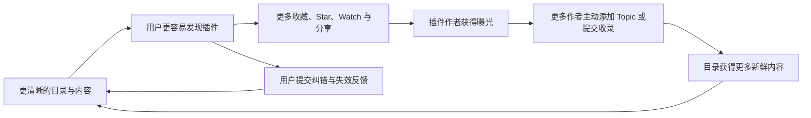

# 从“备份仓库”到“生态入口”：DSH 插件目录的内容优化与运营方法论

> 一份面向开源目录、Awesome List、插件市场索引和开发者资源库的内容运营母稿。

**适合读者**：开源项目维护者、开发者生态运营、产品经理、技术内容创作者。

**建议阅读时间**：25～30 分钟。

**案例来源**：[HackSing/dsh-plugins](https://github.com/HackSing/dsh-plugins) 的定位重构、双语目录建设、社区入口设计和持续运营实践。

**事实校准日期**：2026 年 8 月 15 日（中国标准时间）。当前案例目录收录 105 个插件，采用四个主分类；`Submit a plugin` Issue Form 是唯一官方插件提交入口。

**使用方式**：本文既可以完整发布，也可以按“定位—首页—内容—社区—节奏—指标”拆成系列文章。

---

## 阅读地图

- **第一至三章**：先理解目录的用户价值、运营定位和目标人群；
- **第四至八章**：设计首页、分类、条目、双语内容和参与入口；
- **第九至十一章**：建立内容节奏、增长飞轮和衡量指标；
- **第十二章**：把母稿拆成适合不同媒体平台的内容；
- **第十三章以后**：用于项目实施、团队复盘和上线检查。

如果只想先掌握核心观点，可以阅读第二、四、五、十和十五章。

---

## 一、先说结论：目录仓库运营的不是链接，而是决策效率

插件目录看起来像一张链接表，实际上提供的是三种更重要的价值：

1. **发现效率**：让用户知道生态里已经有什么，不必反复搜索。
2. **选择效率**：用稳定的分类、统一的描述和明确的边界，帮助用户快速缩小范围。
3. **生态可见度**：让插件作者获得持续曝光，也让维护者看到生态正在向哪些方向发展。

因此，运营一个插件目录，不能只问“又收录了多少链接”，而要持续回答三个产品问题：

- 用户能否在一分钟内理解这个目录有什么用？
- 用户能否在几次点击内找到值得进一步了解的插件？
- 开发者能否低成本地提交、修正和传播自己的项目？

如果答案是否定的，那么链接数量再多，也只是一份难以使用的库存。

---

## 二、运营定位建议：不要把“备份”作为首页第一卖点

“备份”是维护机制，不是用户价值。

用户不会因为一个仓库“承担了备份职责”就自然收藏、Star 或分享它。用户采取这些行动，通常是因为仓库帮助他完成了某件具体的事：

- 找到了原本不知道的插件；
- 快速理解了不同插件分别解决什么问题；
- 避免在大量仓库之间反复搜索和比较；
- 获得了一个持续更新的生态观察入口；
- 找到了自己作品被发现、被收录和被传播的渠道；
- 获得了中文与英文之间的信息桥梁。

### 2.1 推荐的定位表达

首页第一层应该表达用户价值：

> 一个独立维护、双语呈现、持续更新的 DSH 插件目录。

第二层再表达产品能力：

- 按主要用途归入少量大类；
- 提供统一、事实性的双语描述；
- 支持插件发现、提交、纠错和失效反馈；
- 通过变更记录和收录报告说明目录如何更新。

第三层才说明维护机制和边界：

- 独立维护，不依赖单一上游目录；
- 保留结构化数据和历史快照，可用于恢复与审计；
- 收录代表“可被发现”，不代表兼容性认证、安全审计或官方推荐。

这个顺序非常重要：**先让用户知道为什么值得使用，再让用户理解它如何被维护，最后说明它不承诺什么。**

### 2.2 “备份”应该放在哪里

“备份”不是不能说，而是应该放在正确的位置：

- 放在项目背景或维护原则中，说明独立性和可恢复性；
- 放在运营文档中，说明数据如何保存、迁移和重建；
- 放在风险说明中，解释上游失效时目录仍可继续维护；
- 不要占据首页主标题、首屏标语和社交分享图的核心位置。

一句话概括：

> 对外卖“发现与选择”，对内做“备份与治理”。

---

## 三、从用户任务出发，而不是从仓库文件出发

一个目录通常同时服务四类人。首页和运营内容需要让他们各自找到下一步。

| 用户角色 | 进入目录时的真实问题 | 目录应提供的答案 | 希望发生的动作 |
| --- | --- | --- | --- |
| DSH 用户 | 有没有插件能解决我的问题？ | 分类入口、事实描述、选择提示 | 浏览、收藏、安装前核查 |
| 插件开发者 | 我的插件怎样被更多人看到？ | 收录标准、提交入口、更新机制 | 添加 Topic、提交收录、分享目录 |
| 生态观察者 | DSH 插件生态正在向哪里发展？ | 分类变化、新增记录、周期快照 | Watch、订阅、引用数据 |
| 维护者与贡献者 | 怎样低成本保持目录准确？ | 结构化数据、自动校验、纠错入口 | 修正信息、报告失效、参与治理 |

这张表决定了首页不应该只有“项目介绍”和“插件列表”。它至少还需要四个行动入口：

- 我想找插件；
- 我开发了插件；
- 我发现信息过期；
- 我想持续收到更新。

在 DSH 插件目录中，这四个入口被放在“从这里开始”区域。它的作用类似产品首页的导航台：让不同目的的访客不必先理解仓库结构，就能直接进入自己的任务。

---

## 四、把 README 当作产品首页，而不是项目说明书

README 是 GitHub 仓库最重要的落地页。一个适合运营的目录首页，建议按照以下顺序组织：

1. 品牌名称与长期可用的视觉图；
2. 一句话价值定位；
3. 简短的目录规模与维护状态；
4. 面向不同角色的“从这里开始”；
5. 大类导航；
6. 插件目录主体；
7. 插件选择建议；
8. 提交、更新与反馈方式；
9. 自动化维护说明；
10. 使用边界和许可证。

这个结构遵循的是“先理解、再行动、后深入”的阅读路径，而不是按照维护者最熟悉的文件结构排列。

### 4.1 首屏必须回答三个问题

用户打开页面后的前十秒，应该能回答：

- 这是什么？——DSH 插件目录。
- 它为什么有用？——帮助发现、理解和跟踪插件。
- 我下一步做什么？——按分类浏览、提交插件或报告问题。

如果首屏需要用户先理解项目迁移史、Git 历史或备份关系，说明内容顺序站在了维护者视角，而不是用户视角。

### 4.2 社交分享图要“常青”，不要绑定实时数字

社交分享图会出现在 GitHub 预览、聊天转发和媒体引用中，更新频率通常远低于 README。把插件总数、分类数量、Star 数或日期直接写在图里，会让它很快过期。

更稳妥的做法是使用长期成立的表达，例如：

- DSH Plugins：发现、构建、扩展；
- Discover, Build, Extend；
- Explore the DSH Plugin Ecosystem；
- 独立、双语、持续维护的插件目录。

实时数字仍然有价值，但应该由 README、Release、报告或动态内容承载，而不是固化在长期视觉资产中。

### 4.3 数量是信任信号，不是核心价值

以 2026 年 8 月 15 日的案例快照为例，“已收录 105 个插件”能够说明目录规模，但不能代替用户价值。更好的表达方式是把数量和使用方式放在一起：

> 当前整理 105 个插件，统一归入四个大类。每个插件只出现一次，并按照最主要的使用价值进行分类。

数字告诉用户“这里有足够内容”，后半句告诉用户“这些内容可以怎样使用”。

这里的 105 是一个时间点快照，不是长期 Slogan。对外转载时应同时标明统计日期，或改写为“100 多个插件”，避免文章发布后因目录继续增长而迅速过期。

---

## 五、分类不是越细越好，而是要降低选择成本

目录早期最常见的问题，是按技术名词、实现方式或插件自我描述不断增加分类。结果通常是：

- 分类数量快速膨胀；
- 每个分类只有一两个项目；
- 同一个插件可以出现在多个位置；
- 用户需要先理解分类体系，才能寻找插件；
- 中英文分类越来越难保持一致。

DSH 插件目录采用四个大类：

1. **交互与体验**：界面、会话、导航、分享及趣味体验；
2. **工具与能力**：视觉、数据、文档、通用工具及模型能力扩展；
3. **自动化与智能体**：工作流、多智能体、定时执行及研究闭环；
4. **开发与生态集成**：平台集成、运行时、沙箱、诊断及插件开发。

### 5.1 分类设计的三个原则

**第一，按用户获得的主要价值分类。**
不要只看仓库用了什么技术，而要看用户安装后首先获得什么。

**第二，一个插件只进入一个主分类。**
多处重复看似增加曝光，实际会造成统计、更新和双语维护混乱。交叉能力可以写进描述，不必重复收录。

**第三，分类数量应随用户任务增长，而不是随插件数量增长。**
只有当一批插件形成了稳定、独立、用户能理解的任务集合时，才值得新增大类。

### 5.2 判断分类是否过细

可以用四个问题快速检查：

- 用户是否能仅凭分类名称预测里面有什么？
- 多数插件是否能明确找到一个主分类？
- 每个分类是否有足够内容形成浏览价值？
- 中英文名称是否都自然、稳定、容易传播？

只要其中两项经常答不上来，就应该考虑合并分类。

---

## 六、目录条目要像产品卡片，而不是广告文案

插件条目的目标，是帮助用户决定“要不要点进去进一步了解”，不是替插件做宣传。

推荐格式：

```markdown
- [插件名称](https://github.com/owner/repository) — 用一句事实性描述说明它帮助 DSH 用户完成什么。
```

### 6.1 一句话描述的写作标准

一条合格的描述应该：

- 只表达一个主要价值；
- 使用具体动作，例如“导入”“渲染”“检查”“连接”“恢复”；
- 不使用“最强”“领先”“革命性”等排名或营销词；
- 不虚构兼容性、性能和安全结论；
- 不把安装方法、版本历史和作者介绍塞进同一句话；
- 中英文表达事实一致，但不要求逐字直译。

例如：

> 将多种 AI 代理工具的历史会话导入 DeepSeek Harness，以便继续对话。

它说明了输入、动作和结果，同时没有替用户下“值得安装”的结论。

### 6.2 为什么事实性文案更适合长期运营

事实性描述有四个运营优势：

- 更容易保持中英文一致；
- 更容易由规则和模型辅助生成；
- 更少引发“夸大宣传”争议；
- 插件版本变化后，描述仍有较高概率成立。

目录越大，文案越需要标准化。否则维护成本会随着插件数量非线性增长。

---

## 七、双语不是复制两份 README，而是建立一个内容系统

双语目录很容易出现三类问题：

- 中文新增了插件，英文忘记同步；
- 名称或链接一致，但分类顺序不同；
- 两种语言对插件能力的描述发生偏差。

因此，成熟做法不是让维护者同时手改两份文件，而是建立单一数据源：

```text
data/plugins.json
        ↓
统一分类与排序
        ↓
README.md + README.zh.md
```

结构化数据保存插件名称、仓库 ID、链接、主分类和双语描述；README 由脚本生成。这样可以把“双语一致性”从编辑习惯变成可验证规则。

### 7.1 双语运营的真正价值

双语不只是扩大阅读范围，还能形成生态桥梁：

- 中文用户更容易发现英文仓库；
- 海外开发者更容易获得中文社区曝光；
- 媒体可以直接引用统一口径；
- 目录可以承担跨语言的生态观察角色。

但必须避免把“有中英文文件”等同于“完成国际化”。真正的标准是：结构一致、事实一致、入口清晰、更新同步。

---

## 八、让用户参与维护，而不是只留下一个“欢迎 PR”

“欢迎贡献”太宽泛，用户往往不知道该提交什么、需要提供哪些证据、提交后会发生什么。

更有效的做法是按任务拆分入口：

- **提交新插件**：提供仓库地址、主要价值、分类、安装与移除说明、兼容性边界；
- **更新插件信息**：说明当前内容、建议修改和证据来源；
- **报告失效链接**：说明 404、迁移、归档或访问受限状态；
- **推荐、展示与讨论**：进入 Discussions，避免开放式话题挤占问题跟踪区。

### 8.1 表单的本质是降低治理成本

一个好的 Issue 表单同时服务两端：

- 对提交者，它说明“怎样的信息才足够”；
- 对维护者，它把自由文本变成相对稳定的输入结构。

表单中最有价值的字段通常不是“插件名称”，而是：

- 插件解决什么问题；
- 安装和移除路径在哪里；
- 支持的 DSH 版本和平台是什么；
- 哪些结论已验证，哪些尚未验证；
- 提议修改的证据来自哪里。

这些字段能显著减少来回追问，也为后续自动化复核提供输入基础。

### 8.2 统一入口后的开发者体验

DSH 目录当前只保留一个新插件提交入口：[Submit a plugin Issue Form](https://github.com/HackSing/dsh-plugins/issues/new?template=submit-plugin.yml)。Topic 是被动发现机制，PR 用于自动化代码、测试、治理和仓库系统文档改进，都不替代这个主动申请入口。

开发者提交后，不需要理解目录数据结构，也不需要同步修改两份 README。系统会在原 Issue 中持续反馈：

1. 收件后进入 `submission:reviewing`；
2. 高置信度通过后，目录、双语 README、CHANGELOG 和报告在同一次发布中更新，原 Issue 返回证据并关闭；
3. 信息不足时进入 `submission:needs-info`，Issue 保持开放，作者完善仓库后可评论 `/recheck`；
4. 已经收录的仓库直接返回现有目录和报告证据；
5. 旧式目录 PR 会收到 Issue Form 引导并关闭，贡献者分支不会被合并或执行。

这个设计把“贡献代码”和“提交收录意图”分开：开发者只负责提供事实，目录系统负责分类、双语内容、校验、发布和报告。

---

## 九、把一次访问变成持续关系

目录项目很容易只有搜索流量，没有持续关系。要让用户回来，需要建立不同频率的内容产品。

### 9.1 日常层：目录本身持续更新

- 新插件进入正确分类；
- 失效链接得到处理；
- 描述、链接和分类保持准确；
- 每次有意义的变化进入 CHANGELOG。

### 9.2 每周层：DSH Plugin Radar

只有出现有价值的新信息时才发布，建议包括：

- 本周新增插件；
- 值得关注的能力变化；
- 已处理的迁移、归档或失效链接；
- 一个具体使用场景；
- 对应目录提交、申请 Issue 或收录报告链接。

周报的目标不是凑固定篇数，而是帮助用户减少生态跟踪成本。

### 9.3 每月层：Ecosystem Snapshot

用 Release 或长文记录：

- 月末目录规模；
- 本月新增、移除与修正；
- 四大分类的变化；
- 失效链接及处理状态；
- 贡献者致谢；
- 明确的验证边界。

月度快照同时具备内容价值和备份价值：用户看到生态变化，维护者获得可追溯节点。

### 9.4 每季度层：治理复盘

- 复核归档和不可访问仓库；
- 检查分类是否仍然符合用户任务；
- 处理重复、迁移和描述漂移；
- 更新选择建议与贡献规则；
- 复核自动化阈值和误判案例。

---

## 十、形成可持续的内容增长飞轮



这个飞轮中，Star 是结果之一，不是唯一目标。真正推动循环的是：

- 内容能解决发现问题；
- 参与入口足够低成本；
- 更新过程透明可信；
- 插件作者能从收录中获得实际曝光；
- 用户愿意把目录作为长期入口分享给别人。

如果只追求 Star，而目录本身缺乏持续更新和选择价值，增长很难沉淀。

---

## 十一、用四组指标衡量运营，而不是只看 Star

### 11.1 发现指标

- 独立访客和页面浏览量；
- 搜索、Topic、社交平台等来源占比；
- README、提交入口和报告页等热门路径；
- 外部文章和社区讨论中的引用次数。

### 11.2 使用与留存指标

- Watch、Clone 和回访趋势；
- 分类导航和插件链接的点击表现；
- 月度快照的阅读或下载情况；
- 用户是否在其他问题中把目录作为参考入口。

### 11.3 参与指标

- 新插件提交量；
- 信息更新和失效链接反馈量；
- 有效贡献者数量；
- 从提交到得到明确结果的时间。

### 11.4 质量指标

- 中英文名称、链接和顺序一致率；
- 失效链接率及修复时长；
- 重复条目和分类争议数量；
- 自动收录误判率；
- 无新增时产生的无效提交或通知数量。

运营初期不要急于设置增长目标。先观察至少两个完整统计窗口，建立基线，再判断增长来自内容质量、外部传播还是短期事件。

---

## 十二、面向媒体分发：一份母稿，多种内容产品

这套方法论适合拆成不同平台的内容，而不是把同一篇长文机械复制到所有渠道。

| 平台 | 推荐切入点 | 内容形态 | 适合的行动引导 |
| --- | --- | --- | --- |
| 公众号 | 从备份仓库到生态入口的完整复盘 | 长文、流程图、案例截图 | 阅读目录、关注后续复盘 |
| 知乎 | 为什么 Awesome List 不应该只做链接堆积 | 问题导向、方法论、反例 | 收藏、讨论、引用 |
| 掘金 | 如何设计一个可维护的双语插件目录 | 信息架构、数据源、校验实践 | 查看仓库、复用结构 |
| 小红书 | 一个插件目录如何变得值得收藏 | 6～9 张卡片、前后对比 | 收藏、转发给开发者 |
| GitHub Discussion | 本月新增与生态观察 | Radar、Snapshot、开放问题 | Watch、提交插件、反馈 |
| 视频或播客 | 从人工整理到自动运营的建设过程 | 时间线、决策冲突、真实案例 | 关注系列、查看完整文档 |

### 12.1 可直接拆分的选题

1. 为什么“备份”不应该是开源仓库的首页卖点；
2. 一个插件目录为什么只需要四个大类；
3. 如何为 100 多个插件写统一、可信的一句话介绍；
4. 双语 README 为什么必须由结构化数据生成；
5. GitHub Issue 表单怎样降低社区运营成本；
6. 社交分享图为什么不应该写实时数字；
7. 除了 Star，开源目录还应该看哪些指标；
8. 如何把周报、月报和变更记录做成生态内容产品。
9. 同一个自动提交入口怎样分别处理“需要补充”和“正式收录”。

### 12.2 分发时保持两个边界

- 不把“被目录收录”写成兼容性或安全认证；
- 不用容易过期的总数、排名和“第一”作为长期标题核心。

实时数据可以成为当期内容的新闻点，但不应成为整个品牌定位。

---

## 十三、落地路线：先把目录变得可用，再追求规模

### 第一阶段：建立可信首页

- 明确用户价值定位；
- 重写首屏和“从这里开始”；
- 合并过细分类；
- 统一条目格式和事实性文案；
- 补充选择建议与验证边界；
- 使用不依赖实时数字的视觉资产。

### 第二阶段：建立参与和治理入口

- 增加插件提交、信息更新和失效链接表单；
- 明确贡献标准、许可证和行为规范；
- 明确 Issue Form 是插件提交入口，PR 用于仓库系统改进，Discussion 用于开放讨论；
- 建立 CHANGELOG 和周期快照。

### 第三阶段：建立质量与运营节奏

- 使用结构化数据生成目录；
- 自动检查双语一致性、重复项和链接状态；
- 发布周度 Radar、月度 Snapshot；
- 建立运营指标基线；
- 将新增与异常处理逐步自动化。

### 第四阶段：形成媒体和生态循环

- 把变更报告改编为媒体素材；
- 与插件作者形成双向传播；
- 用真实使用场景代替简单清单转发；
- 根据搜索词、反馈和提交情况调整分类与选题。

---

## 十四、常见误区与修正方式

| 常见误区 | 为什么会失效 | 修正方式 |
| --- | --- | --- |
| 把“备份”写成首屏核心价值 | 用户看不到与自己有关的收益 | 首屏强调发现、选择和持续更新 |
| 分类越多越显得专业 | 用户需要先学习分类体系 | 围绕主要用户价值合并为少量大类 |
| 同一插件放入多个分类 | 重复、统计和同步成本增加 | 只保留一个主分类，描述补充交叉能力 |
| 用宣传语代替事实描述 | 难验证、易过期、容易引发争议 | 使用单句、可核查的能力说明 |
| 社交图写死总数和日期 | 视觉资产迅速过期 | 使用常青 Slogan，实时信息放在正文 |
| 只写“欢迎贡献” | 用户不知道怎样贡献 | 按任务提供结构化表单和明确证据要求 |
| 只追踪 Star | 看不到使用、参与和质量 | 同时观察发现、留存、参与和质量指标 |
| 频繁发布但没有新信息 | 消耗关注者信任 | 只有出现有意义变化时才发布 Radar |

---

## 十五、这次实践沉淀出的五条通用原则

1. **用户价值优先于维护机制。** 备份、迁移和自动化都重要，但它们应当服务于发现、选择和信任。
2. **目录是一种产品。** README 是首页，分类是导航，条目是产品卡片，提交表单是用户入口，报告是信任机制。
3. **少量稳定规则优于大量临时判断。** 大类、单一主分类、事实性单句和双语一致性，能够显著降低长期成本。
4. **内容运营必须与治理能力同步。** 传播带来更多提交和反馈，如果没有标准、表单、校验和异常处理，增长会反过来压垮维护者。
5. **透明边界比过度承诺更能建立信任。** 明确“收录不等于认证”，不会削弱目录价值，反而能让用户正确理解它。

最终，一个值得收藏和分享的插件目录，不是因为它保存了多少链接，而是因为它长期、稳定地帮助用户理解一个正在变化的生态。

---

## 附录：DSH 案例中的已落地内容与证据边界

截至 2026 年 8 月 15 日，本案例已经确认落地：

- 独立、双语、持续维护的首页定位；
- 四个面向用户价值的大类；
- 105 个正式插件，名称、链接和顺序在中英文目录中一一对应；
- 单一结构化数据源与双语目录生成；
- Issue Form 唯一插件提交入口，以及信息更新和失效链接入口；
- 贡献规范、行为规范、CHANGELOG 与运营手册；
- 常青社交分享图；
- 目录质量检查、链接检查和自动收录报告；
- Topic 自动发现与 Issue Form 主动申请两条候选来源；
- 每 30 分钟运行的 Issue 收件与状态治理；
- 旧式插件 PR 自动引导至 Issue Form，正常工程 PR 保持开放；
- [Issue #8](https://github.com/HackSing/dsh-plugins/issues/8) 的 `needs-info` 可恢复分支验证；
- [Issue #13](https://github.com/HackSing/dsh-plugins/issues/13) 的高置信度无人值守收录验证；
- [报告 Issue #17](https://github.com/HackSing/dsh-plugins/issues/17) 的自动生成与送达；
- 已关闭申请重复运行时不重复复核、不重复评论、不重复报告的幂等验证。

其中，“每周 Radar、月度 Snapshot、季度治理复盘和媒体矩阵”属于运营方法与建议节奏，应根据实际生态活跃度持续执行，不应仅凭文档存在就表述为已经完成。

相关资料：

- [中文目录](../README.zh.md)
- [贡献规范](../CONTRIBUTING.md)
- [运营手册](../OPERATIONS.md)
- [自动收录方案](AUTOMATED_INGESTION_PLAN.zh.md)
- [PR 自动处理历史方案](PR_SUBMISSION_AUTOMATION.zh.md)
